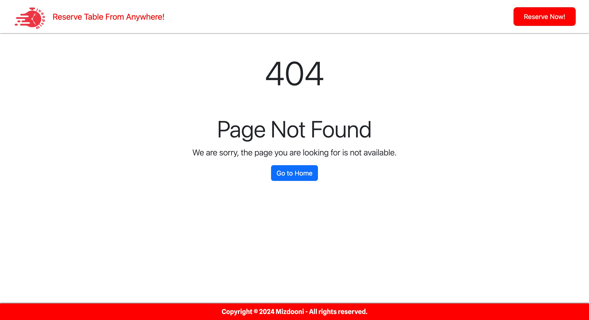

# Internet-Engineering

## Overview

**MizDooni** is a Restaurant Table Reservation System developed as part of the Internet Engineering course at the University of Tehran. The system allows users to explore a variety of restaurants across different cities, filter them by specific characteristics, and book their preferred tables. After dining, users can provide feedback and share their experiences.

## Phases

- **CA1**: Logic Domain, Git, Maven, Unit Testing (JUnit)
- **CA2**: Tomcat, Servlet, JSP, MVC, HTML, CSS (Designed a simple UI ourselves)
- **CA3**: HTML, CSS, Figma (Designed UI based on Figma provided to us)
- **CA4**: React, Spring, Standard API
- **CA5**: MySQL Database, JDBC, ORM, Hibernate
- **CA6**: Authentication, JWT, OAuth, JWT Authentication Filter, SQL Injection
- **CA7**: APM (Application Performance Management), Elastic APM
- **CA8**: Docker, Dockerfile, Docker Compose

## Screenshots

### Logic Tests

### UI Designs
#### Our Design

#### Figma Design

### APIs

### Database

### Docker

## Contributors

- [Mohammad Mohajel](https://github.com/mohajel)
- [Mostafa Ebrahimi](https://github.com/Ebrahimi-Mostafa)